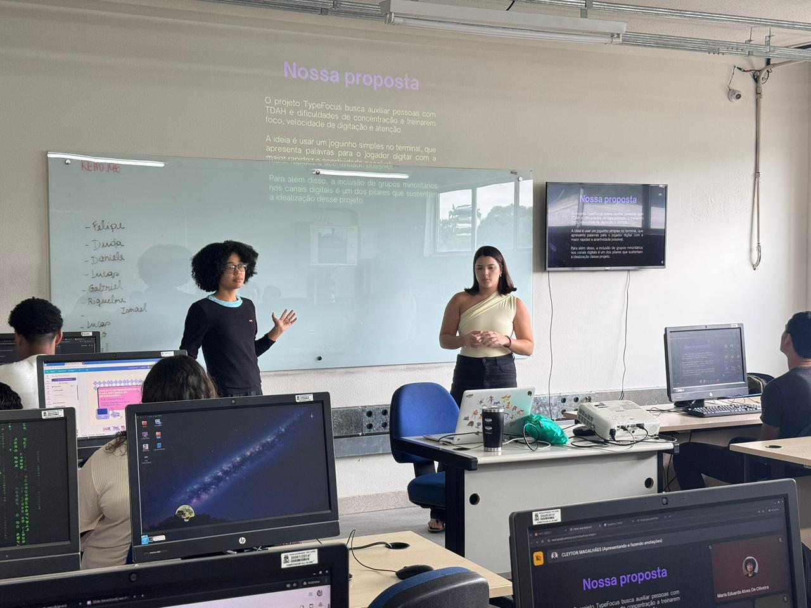

# TypeFocus

## Projeto TypeFocus - PISI1
**Jogo de reflexo e digitação para auxiliar pessoas com TDAH**

### Nossa proposta
O projeto TypeFocus busca auxiliar pessoas com TDAH e dificuldades de concentração a treinarem foco, velocidade de digitação e atenção.  
O jogo é simples, executado no terminal, e apresenta palavras para o jogador digitar com rapidez e precisão.  
Além disso, o projeto valoriza inclusão e acessibilidade em ambientes digitais, oferecendo experiência de aprendizado divertida e motivadora.

### Área de aplicação
1. **Finalidade:** melhorar foco, atenção e velocidade de reação em pessoas com TDAH.  
2. **Solução:** jogo no terminal que treina:
   - Atenção sustentada;
   - Tempo de reação;
   - Motivação através de feedback imediato.

---

## Como jogar?

1. Abra o terminal e execute o arquivo principal `main.py`.  
2. Digite seu **nome**, **idade** e se possui TDAH.  
3. Escolha o **idioma** do jogo:
   - Português 🇧🇷  
   - Inglês 🇺🇸  
   - Espanhol 🇪🇸  
4. Escolha o **nível de dificuldade**:
   - Fácil: palavras curtas, ótimo para começar.
   - Médio: palavras médias, ritmo equilibrado.
   - Difícil: palavras longas, exige mais foco.
   - Padrão: dificuldade aumenta gradualmente conforme o jogador acerta.  
5. Uma palavra é exibida e inicia uma **contagem regressiva (3, 2, 1)**.  
6. Digite a palavra **exatamente igual**, sem pressionar ENTER (entrada em tempo real).  
   - Se errar, tente novamente.  
   - Se o tempo ultrapassar 60 segundos, a rodada termina automaticamente.  
7. Ao acertar, o jogo mostra **tempo e pontuação**, incluindo **bônus por combos e streaks**:
   - Sem erros: +20 pontos  
   - Combo de acertos consecutivos: +10 pontos por rodada  
   - Recorde pessoal batido: +30 pontos  
8. Você pode:
   - Jogar novamente;  
   - Trocar de dificuldade;  
   - Encerrar o jogo.  
9. No final, o **mascote TypeBot** se despede com uma mensagem personalizada.

---

## Novos recursos da segunda avaliação

- **Sistema de streaks (combos)**  
- **Ranking comparativo**: melhores pontuações da sessão e histórico geral.  
- **Estatísticas + mensagens motivacionais** por rodada.  
- **Feedback em tempo real**: digitação sem precisar pressionar ENTER.  
- **Histórico dos jogadores**: armazenando:
  - Perfil (nome, idade, TDAH)  
  - Partidas jogadas  
  - Pontuação, tempo e streak  
  - Feedback opcional do jogador  

---

## Releases

### Primeira versão
- RF001 – Menu inicial com botão "Jogar"  
- RF002 – Escolher palavra aleatória  
- RF003 – Contagem regressiva (3,2,1)  
- RF004 – Entrada do jogador + timer  
- RF005 – Exibir tempo + pontuação  
- RF006 – Opção de jogar novamente ou sair  
- RF007 – Cadastrar nome do jogador  
- RF008 – Escolha de nível de dificuldade  
- RF009 – Mascote  

### Segunda versão
- RF010 – Escolha do idioma (Português, Inglês ou Espanhol)  
- RF011 – Sistema de streaks (combos)  
- RF012 – Ranking comparativo  
- RF013 – Estatísticas + mensagens motivacionais  
- RF014 – Feedback em tempo real (sem ENTER)  
- RF015 – Histórico dos jogadores (arquivo `historico.json`)  
- RF016 – Interface gráfica

---

## Linguagem

**Python 3.12**

### Bibliotecas
- **time** → controle do tempo de digitação e contagem regressiva.  
- **random** → sorteio aleatório das palavras.  
- **json** → salvar e carregar dados dos jogadores e histórico.  
- **os** → verificação da existência de arquivos (`jogadores.json`, `historico.json`).  
- **colorama** → cores no terminal para melhor visualização.  

### Estruturas utilizadas
- **Estruturas de decisão:** `if`, `elif`, `else` – validações de dados e fluxo de jogo.  
- **Estruturas de repetição:** `while` – mantém o menu e o jogo rodando até encerrar.  
- **Listas:** armazenam palavras disponíveis, histórico temporário de sessão.  
- **Dicionários:** informações de cada jogador (perfil, pontuação, streaks).  
- **Funções:** modularização do código, facilita manutenção e testes.  

---

## Arquivos importantes

- `main.py` → entrada principal e menu do jogo  
- `jogo/game.py` → lógica principal do jogo e regras  
- `palavras/palavras.py` → listas de palavras por nível e idioma  
- `utils/utils.py` → funções auxiliares (calcular pontos, input em tempo real)  
- `jogadores/crud.py` → cadastro, edição e exclusão de jogadores  
- `ranking.json` → ranking da sessão  
- `historico.json` → histórico completo de jogadores  

---

## Observações
- O jogo funciona em terminais compatíveis com Python 3.  
- Recomendado usar **terminal padrão** no Windows, Linux ou macOS.  
- Para idiomas, a bandeira do mascote muda automaticamente.  
- Feedback opcional do jogador é salvo no histórico para futuras análises e estatísticas.  

---

## Interface Gráfica (GUI)

Tem também uma versão com interface simples feita em `pygame` — o arquivo é `gui.py`.

- Para experimentar rápido: instale o `pygame` e execute `python gui.py`.
- Assets (opcionais): coloque imagens em `assets/` para personalizar (`menu_bg.*`, `bg.*`, `result_bg.*`).
- Sons (opcionais): `assets/countdown.wav`, `assets/countdown_final.wav`, `assets/countdown_continuous.wav`.
- Controles: pressione `Enter` para começar/voltar ao menu; digite a palavra (não precisa apertar Enter para confirmar).
- Se faltar imagem ou som, a GUI usa um fundo simples e fica sem áudio — o jogo continua normalmente.
